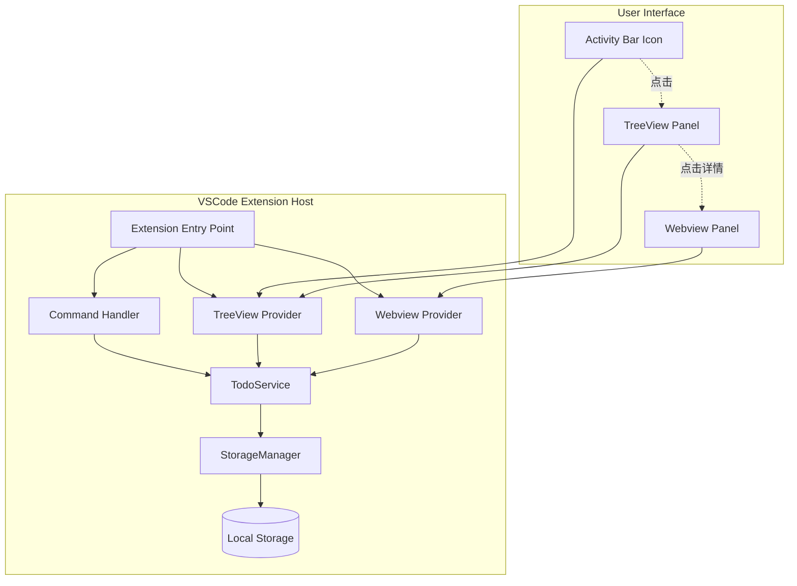
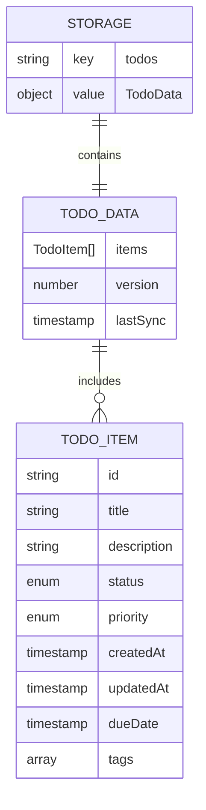
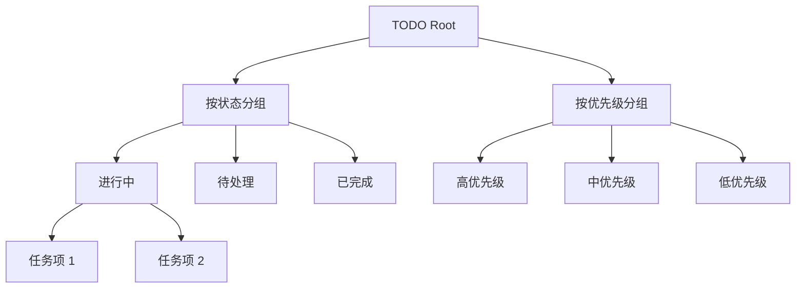
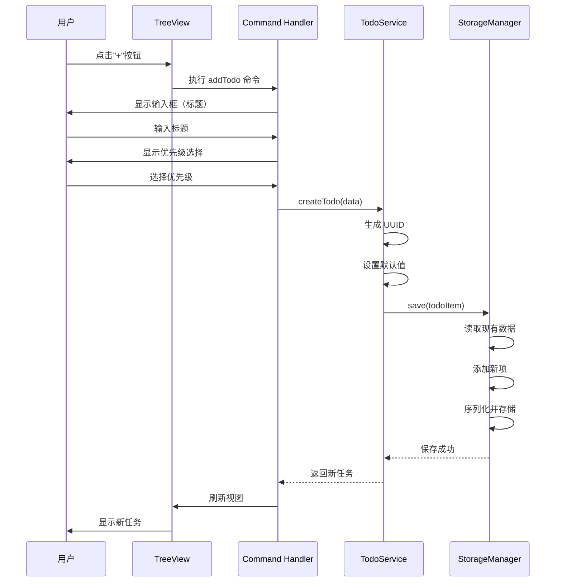
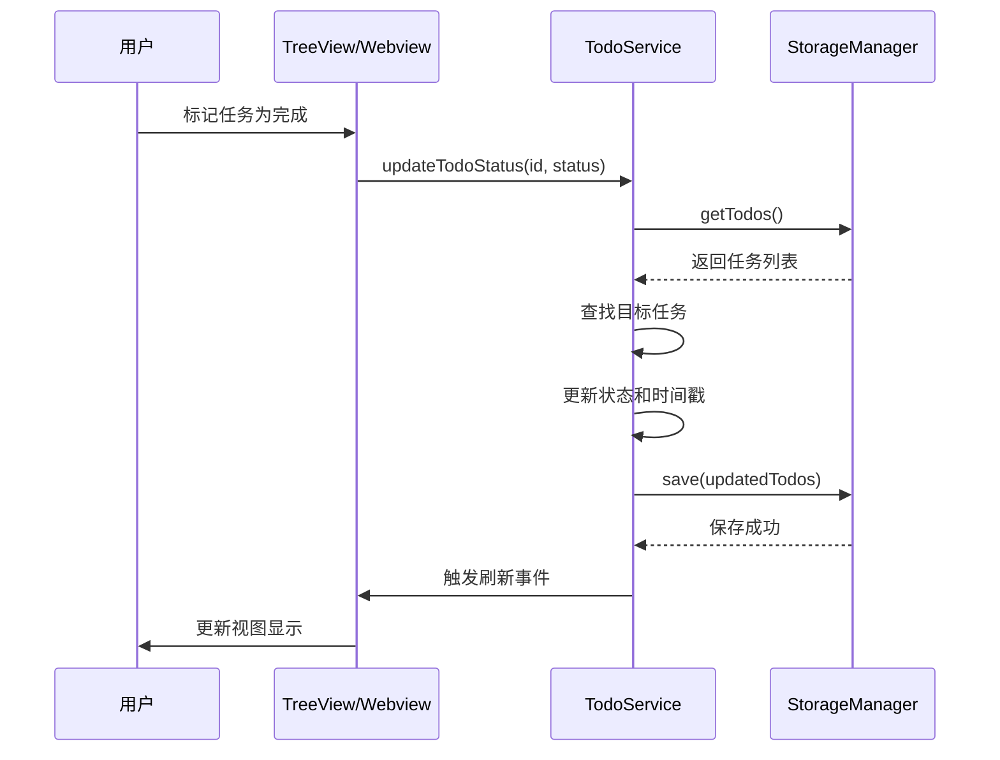
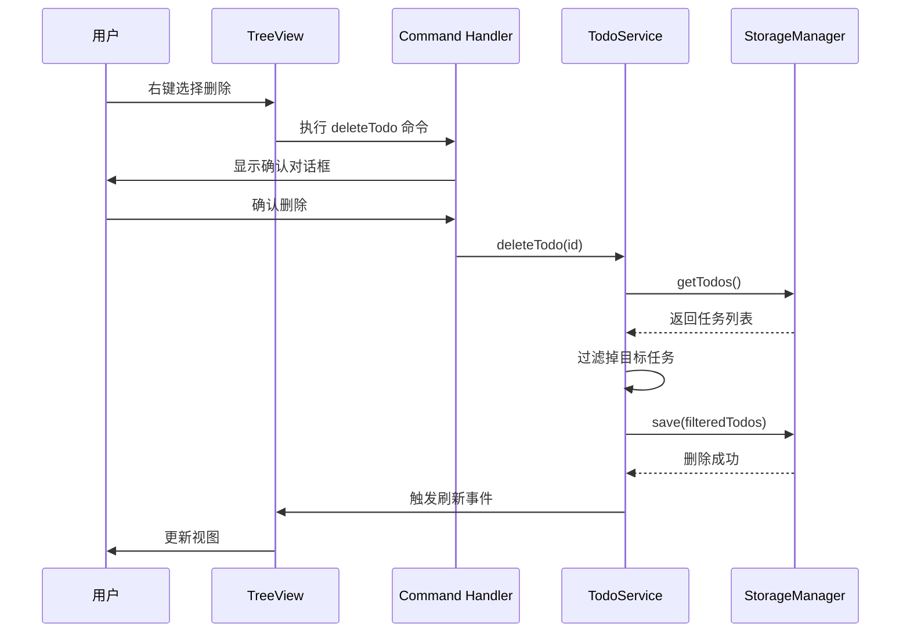
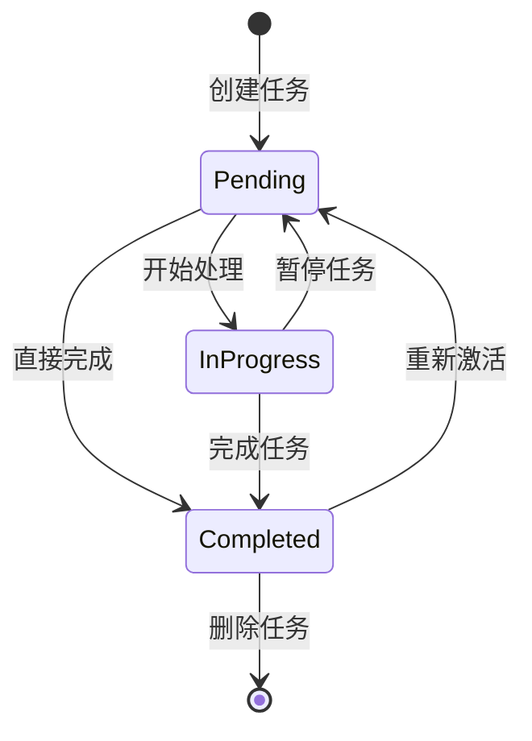
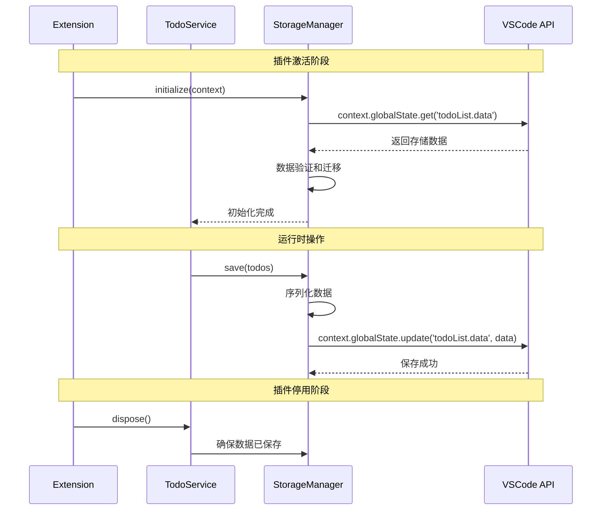
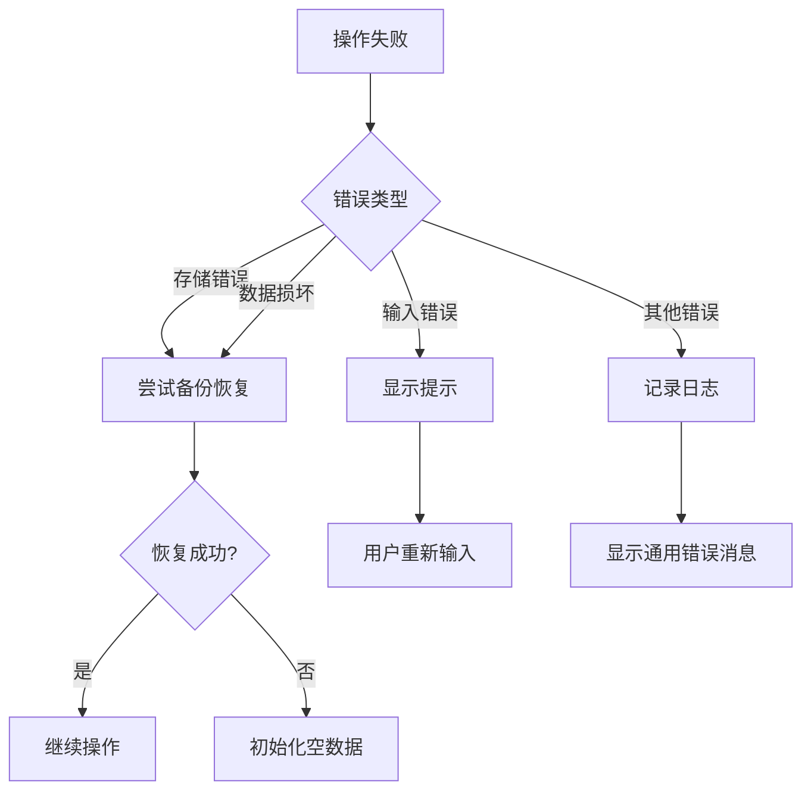

# VSCode TODO 插件设计文档

## 1. 概述

### 1.1 项目简介
本项目旨在开发一个基于 VSCode 的待办事项管理插件，提供美观且可交互的用户界面，帮助开发者在编码过程中高效管理任务。

### 1.2 核心价值
- **便捷性**：在开发环境内直接管理待办事项，无需切换应用
- **直观性**：提供美观的可视化界面，清晰展示任务状态
- **持久性**：本地存储数据，确保数据安全和隐私

### 1.3 目标用户
使用 VSCode 进行开发的程序员和知识工作者，需要在编码过程中管理任务和待办事项。

## 2. 技术栈与依赖

| 技术类型 | 选择方案 | 说明 |
|---------|---------|------|
| 开发语言 | TypeScript | VSCode 插件推荐语言，提供类型安全 |
| UI 框架 | Webview API + HTML/CSS/JavaScript | VSCode 官方提供的 UI 渲染方案 |
| 存储方案 | VSCode ExtensionContext.globalState | 本地键值存储 |
| 构建工具 | webpack/esbuild | 打包和编译插件代码 |
| 测试框架 | VSCode Extension Test Runner | 插件单元测试 |
| 图标资源 | SVG 格式 | 适用于不同主题和分辨率 |

## 3. 架构设计

### 3.1 整体架构

### 3.2 组件职责

| 组件名称 | 职责描述 |
|---------|---------|
| Extension Entry Point | 插件激活入口，注册命令和视图 |
| Command Handler | 处理用户命令（添加、删除、编辑任务等） |
| TreeView Provider | 提供侧边栏树状视图数据 |
| Webview Provider | 提供详细视图的 HTML 内容 |
| TodoService | 业务逻辑层，管理任务的 CRUD 操作 |
| StorageManager | 数据持久化层，封装存储操作 |

## 4. 数据模型

### 4.1 TodoItem 数据结构

| 字段名 | 数据类型 | 说明 | 必填 |
|--------|---------|------|------|
| id | string | 唯一标识符（UUID） | 是 |
| title | string | 任务标题 | 是 |
| description | string | 任务详细描述 | 否 |
| status | enum | 任务状态：pending/in-progress/completed | 是 |
| priority | enum | 优先级：low/medium/high | 是 |
| createdAt | timestamp | 创建时间 | 是 |
| updatedAt | timestamp | 最后更新时间 | 是 |
| dueDate | timestamp | 截止日期 | 否 |
| tags | string[] | 标签列表 | 否 |

### 4.2 数据存储结构

### 4.3 存储策略

| 策略项 | 说明 |
|--------|------|
| 存储键名 | `todoList.data` |
| 存储位置 | VSCode globalState（全局工作区） |
| 数据格式 | JSON 序列化 |
| 版本控制 | 包含 version 字段，便于未来数据迁移 |
| 备份机制 | 每次更新前保留上一版本的副本 |

## 5. 用户界面设计

### 5.1 Activity Bar 图标

| 属性 | 规格 |
|------|------|
| 图标名称 | TODO |
| 图标格式 | SVG |
| 尺寸 | 28x28 像素（推荐） |
| 颜色适配 | 支持 light/dark 主题自动切换 |
| 位置 | VSCode 左侧活动栏 |

### 5.2 TreeView 侧边栏视图

#### 5.2.1 视图层级结构

#### 5.2.2 TreeView 交互功能

| 交互操作 | 触发方式 | 执行动作 |
|---------|---------|---------|
| 添加任务 | 点击工具栏"+"按钮 | 打开输入框 |
| 查看详情 | 单击任务项 | 在 Webview 中展示详情 |
| 标记完成 | 右键菜单或勾选框 | 更新任务状态 |
| 删除任务 | 右键菜单 | 删除并刷新视图 |
| 编辑任务 | 右键菜单 | 打开编辑界面 |
| 刷新列表 | 点击刷新按钮 | 重新加载数据 |

### 5.3 Webview 详情视图

#### 5.3.1 视图内容

| 区域 | 内容 | 样式特点 |
|------|------|---------|
| 标题区 | 任务标题、状态徽章 | 大字体、醒目颜色 |
| 元信息区 | 优先级、创建时间、截止日期 | 图标+文字排列 |
| 描述区 | 任务详细描述 | 支持 Markdown 渲染 |
| 标签区 | 标签列表 | 彩色标签样式 |
| 操作区 | 编辑、删除、状态切换按钮 | 底部固定操作栏 |

#### 5.3.2 视觉风格

| 设计元素 | 规范 |
|---------|------|
| 色彩方案 | 跟随 VSCode 主题（dark/light） |
| 字体 | 使用 VSCode 默认字体栈 |
| 间距 | 遵循 8px 网格系统 |
| 动画 | 使用平滑过渡效果（0.2s ease） |
| 响应式 | 适配不同面板宽度 |

### 5.4 状态和优先级视觉映射

#### 状态颜色映射

| 状态 | 颜色 | 图标 |
|------|------|------|
| pending | 灰色 | 圆圈 |
| in-progress | 蓝色 | 进度圈 |
| completed | 绿色 | 勾选标记 |

#### 优先级颜色映射

| 优先级 | 颜色 | 标识 |
|--------|------|------|
| high | 红色 | !!! |
| medium | 橙色 | !! |
| low | 绿色 | ! |

## 6. 功能特性架构

### 6.1 核心功能流程

#### 6.1.1 添加任务流程

#### 6.1.2 更新任务状态流程

#### 6.1.3 删除任务流程

### 6.2 功能清单

| 功能模块 | 功能点 | 优先级 |
|---------|--------|-------|
| 任务管理 | 创建任务 | P0 |
| 任务管理 | 编辑任务 | P0 |
| 任务管理 | 删除任务 | P0 |
| 任务管理 | 更新任务状态 | P0 |
| 任务查看 | TreeView 列表展示 | P0 |
| 任务查看 | Webview 详情展示 | P0 |
| 任务查看 | 按状态分组 | P1 |
| 任务查看 | 按优先级分组 | P1 |
| 任务增强 | 添加标签 | P1 |
| 任务增强 | 设置截止日期 | P1 |
| 任务增强 | Markdown 描述支持 | P2 |
| 数据管理 | 本地持久化 | P0 |
| 数据管理 | 数据导出 | P2 |
| 数据管理 | 数据导入 | P2 |

## 7. 命令与快捷键

### 7.1 命令定义

| 命令 ID | 命令标题 | 功能描述 |
|---------|---------|---------|
| todo.addTodo | Add TODO | 添加新的待办事项 |
| todo.editTodo | Edit TODO | 编辑选中的待办事项 |
| todo.deleteTodo | Delete TODO | 删除选中的待办事项 |
| todo.toggleStatus | Toggle Status | 切换任务完成状态 |
| todo.showDetails | Show Details | 在 Webview 中显示任务详情 |
| todo.refresh | Refresh | 刷新任务列表 |
| todo.clearCompleted | Clear Completed | 清除所有已完成任务 |

### 7.2 快捷键绑定（建议）

| 命令 | 快捷键 | 适用场景 |
|------|--------|---------|
| todo.addTodo | Ctrl+Shift+T (Win/Linux) Cmd+Shift+T (Mac) | 全局 |
| todo.toggleStatus | Ctrl+Enter | 任务项获得焦点时 |

## 8. 配置项

### 8.1 用户配置

| 配置项 | 类型 | 默认值 | 说明 |
|--------|------|--------|------|
| todo.defaultPriority | enum | medium | 新任务的默认优先级 |
| todo.groupBy | enum | status | 默认分组方式（status/priority/none） |
| todo.autoRefresh | boolean | true | 是否自动刷新列表 |
| todo.confirmDelete | boolean | true | 删除前是否显示确认对话框 |
| todo.showCompletedTasks | boolean | true | 是否显示已完成的任务 |
| todo.dateFormat | string | YYYY-MM-DD | 日期显示格式 |

## 9. 状态管理

### 9.1 状态流转图

### 9.2 状态规则

| 当前状态 | 允许转换 | 限制条件 |
|---------|---------|---------|
| pending | in-progress, completed | 无限制 |
| in-progress | pending, completed | 无限制 |
| completed | pending, in-progress | 无限制（可重新激活） |

## 10. 数据持久化架构

### 10.1 存储生命周期

### 10.2 数据备份策略

| 策略 | 说明 |
|------|------|
| 自动备份 | 每次数据更新前，保存当前版本到备份键 |
| 备份键名 | `todoList.data.backup` |
| 备份数量 | 保留最近 1 个版本 |
| 恢复机制 | 检测到数据损坏时自动从备份恢复 |

## 11. 错误处理

### 11.1 错误类型与处理策略

| 错误类型 | 触发场景 | 处理策略 |
|---------|---------|---------|
| 存储失败 | 写入 globalState 失败 | 显示错误通知，尝试从备份恢复 |
| 数据损坏 | JSON 解析失败 | 从备份恢复，若失败则初始化为空数据 |
| 无效输入 | 用户输入验证失败 | 显示友好提示，要求重新输入 |
| 任务不存在 | 操作已删除的任务 | 静默忽略，刷新视图 |
| 网络错误 | 未来扩展功能（云同步） | 显示离线模式提示 |

### 11.2 错误恢复流程

## 12. 扩展性设计

### 12.1 插件扩展点

| 扩展点 | 说明 | 用途示例 |
|--------|------|---------|
| 自定义字段 | 允许在 TodoItem 中添加自定义属性 | 添加项目关联、工时估算等 |
| 过滤器插件 | 支持自定义任务过滤逻辑 | 按项目、按时间范围过滤 |
| 主题定制 | 支持自定义 Webview 主题 | 个性化视觉风格 |
| 导出格式 | 支持多种导出格式 | Markdown, JSON, CSV |

### 12.2 未来功能预留

| 功能 | 优先级 | 依赖 |
|------|--------|------|
| 云同步 | P3 | 需要云服务支持 |
| 团队协作 | P3 | 需要服务端支持 |
| 智能提醒 | P2 | 基于截止日期的通知 |
| 统计报表 | P2 | 任务完成情况分析 |
| Git 集成 | P2 | 关联 Git 提交和分支 |

## 13. 测试策略

### 13.1 单元测试覆盖

| 测试模块 | 测试重点 | 覆盖目标 |
|---------|---------|---------|
| TodoService | CRUD 操作逻辑正确性 | 90%+ |
| StorageManager | 数据序列化和持久化 | 90%+ |
| Command Handler | 命令执行流程 | 80%+ |
| TreeView Provider | 数据提供和刷新 | 80%+ |

### 13.2 测试用例类型

| 用例类型 | 说明 | 示例 |
|---------|------|------|
| 功能测试 | 验证核心功能正确性 | 创建任务后能正确保存和显示 |
| 边界测试 | 测试极端情况 | 空标题、超长标题、特殊字符 |
| 状态测试 | 验证状态转换 | 所有状态转换路径可达 |
| 持久化测试 | 验证数据存储 | 重启插件后数据不丢失 |
| UI 交互测试 | 验证用户操作 | 点击、右键菜单、快捷键 |

### 13.3 测试环境

| 环境 | VSCode 版本 | 操作系统 |
|------|------------|---------|
| 开发环境 | 最新稳定版 | Windows/macOS/Linux |
| CI 环境 | 最低支持版本 + 最新版 | Linux |

## 14. 性能考虑

### 14.1 性能指标

| 指标 | 目标值 | 说明 |
|------|--------|------|
| 插件激活时间 | < 200ms | 从激活到可用的时间 |
| 任务列表渲染 | < 100ms | 1000 个任务的渲染时间 |
| 数据保存延迟 | < 50ms | 单次保存操作耗时 |
| 内存占用 | < 20MB | 运行时内存峰值 |

### 14.2 性能优化策略

| 策略 | 说明 | 应用场景 |
|------|------|---------|
| 延迟加载 | Webview 按需创建 | 仅在用户打开详情时加载 |
| 虚拟滚动 | 大量任务时使用虚拟列表 | TreeView 超过 100 项 |
| 防抖节流 | 限制高频操作 | 搜索、筛选等输入操作 |
| 数据缓存 | 内存缓存任务列表 | 避免频繁读取存储 |
| 增量更新 | 仅更新变化的部分 | TreeView 刷新时 |

## 15. 安全性

### 15.1 安全措施

| 措施 | 说明 |
|------|------|
| 输入验证 | 所有用户输入进行格式和长度验证 |
| XSS 防护 | Webview 中使用内容安全策略（CSP） |
| 数据隔离 | 每个工作区的数据相互隔离（可选） |
| 敏感信息 | 不存储任何敏感信息（密码、token 等） |

### 15.2 内容安全策略（CSP）

Webview 应用的安全策略规则：

| 指令 | 值 | 说明 |
|------|-----|------|
| default-src | 'none' | 默认禁止所有来源 |
| script-src | vscode-resource: 'unsafe-inline' | 仅允许本地脚本 |
| style-src | vscode-resource: 'unsafe-inline' | 仅允许本地样式 |
| img-src | vscode-resource: https: | 允许本地和 HTTPS 图片 |